<div align="center">

# Emily OS

**An AI-native desktop operating platform for Windows 11.**
Multi-agent reasoning · durable missions · real desktop & browser automation · local multilingual voice · enterprise-grade observability.

[](https://www.python.org/)
[](#requirements)
[](LICENSE)
[](#roadmap)
[](#quality-gates)
[](#monorepo-layout)

[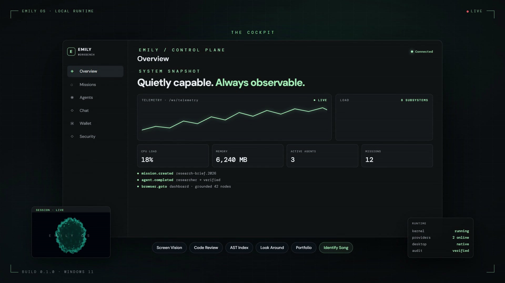](brag-output/brag.mp4)

▶ **Watch the 35-second launch film:** [`brag-output/brag.mp4`](brag-output/brag.mp4)

</div>

---

Emily OS is not a chatbot wrapper. It is a modular, event-driven operating
platform in which the intelligence is the operating system itself: an executive
kernel coordinates nineteen bounded-context packages that plan, execute,
verify, and remember — then act on the real machine through native Windows,
browser, vision, and voice runtimes.

## Table of contents

- [Why Emily](#why-emily)
- [What it is](#what-it-is)
- [Architecture](#architecture)
- [How a mission runs](#how-a-mission-runs)
- [Cognition: providers, agents, memory](#cognition-providers-agents-memory)
- [Runtimes: tools, desktop, browser, voice, vision](#runtimes-tools-desktop-browser-voice-vision)
- [Trust: security & observability](#trust-security--observability)
- [The Workbench](#the-workbench)
- [Monorepo layout](#monorepo-layout)
- [Quick start](#quick-start)
- [CLI reference](#cli-reference)
- [Configuration](#configuration)
- [Quality gates](#quality-gates)
- [Roadmap](#roadmap)
- [License](#license)

---

## Why Emily

Modern work is spread across dozens of apps that share nothing. Assistants can
talk, but they cannot operate the machine, and nothing about their reasoning is
inspectable. Emily closes that gap with one platform:

- **It reasons** — missions are decomposed by a provider-backed planner and run
  as durable graphs, not one-shot prompts.
- **It acts** — a permission-gated tool runtime drives real Win32 windows, a
  real Chromium browser, and on-device screenshot understanding.
- **It listens and speaks** — a local, multilingual voice loop with VAD,
  streaming ASR, barge-in, and a four-engine TTS router.
- **It remembers** — sixteen kinds of memory plus a continuously updated world
  model of entities, relations, and facts.
- **It stays observable** — every subsystem emits typed events, metrics, traces,
  and a tamper-evident, SHA-256 hash-chained audit log.

## What it is

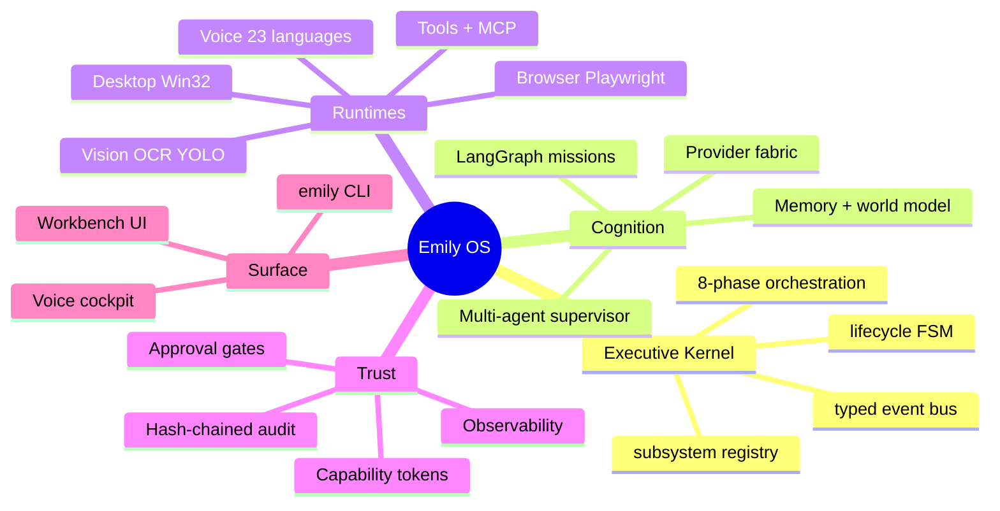

## Architecture

The kernel owns lifecycle and coordination only — never reasoning. Every
capability lives in a package that implements a protocol port defined in
`emily-core`, communicates over the event bus, and registers its tools with the
unified tool runtime.

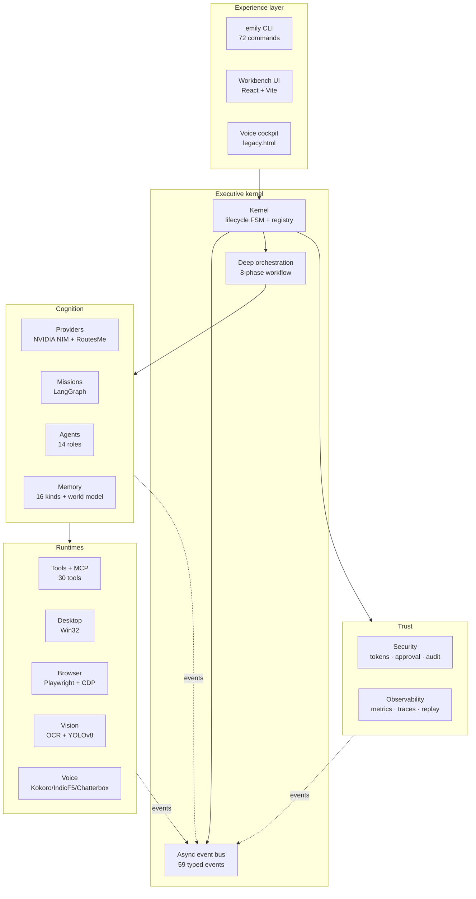

**Kernel lifecycle** — start/stop ordering is priority-driven; a failed start
flips the kernel to `FAILED` and surfaces the error.

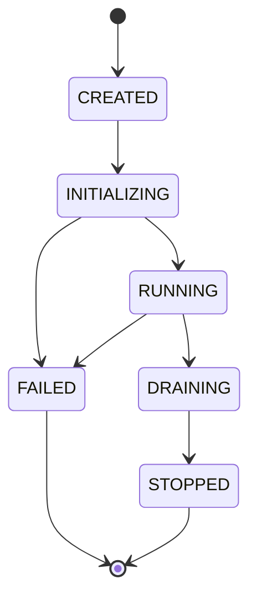

**Event model** — one in-process async bus with prefix subscriptions,
middleware "onion" wrapping, and per-handler exception isolation so a failing
subscriber can never break delivery.

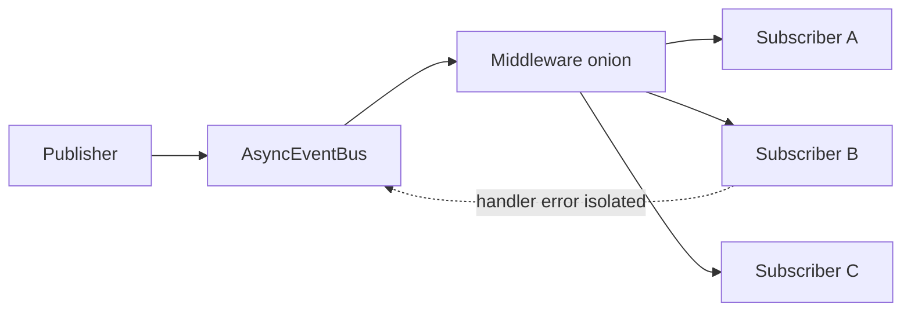

## How a mission runs

A mission is the unit of work: `Mission → Objective → Task`, executed on a
LangGraph backbone with checkpoints and first-class pause / resume / cancel.

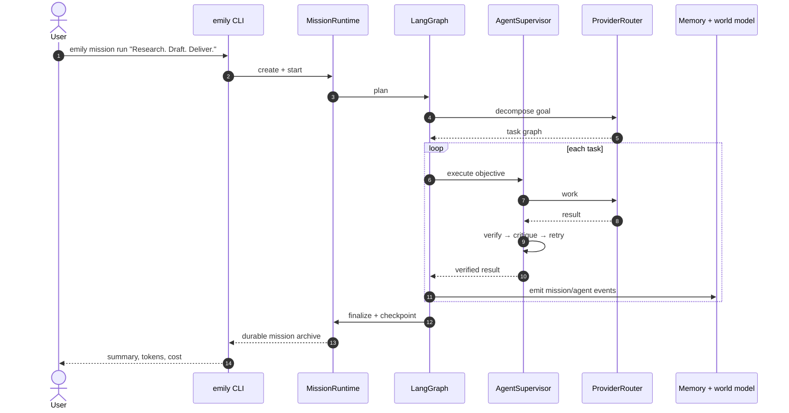

Execution graph:

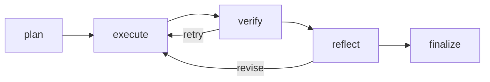

The planner is **provider-backed and fails closed** — it never emits a silent
fake plan; a deterministic heuristic path is used only when explicitly
requested.

## Cognition: providers, agents, memory

### Provider fabric

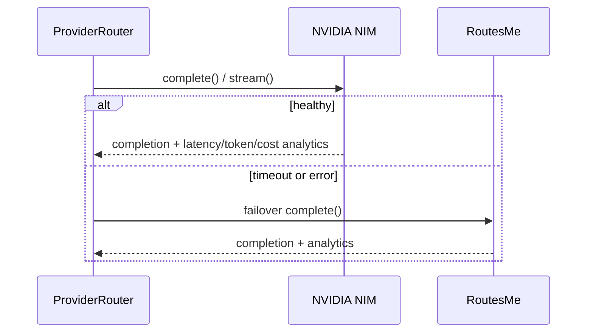

Two adapters over one OpenAI-compatible transport, default-on failover, transport
retries, streaming SSE parsing, and per-call cost accounting.

### Multi-agent verification loop

Ephemeral agents are spawned from a role registry, supervised with a concurrency
pool, and driven through a work → verify → critique → capped-retry loop that
returns a structured `VerificationDecision`. Teams run as sequential pipelines
with handoff, or concurrent fan-out.

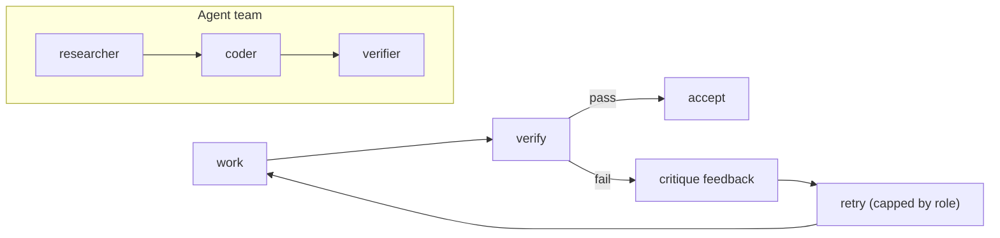

### Memory & world model

Sixteen `MemoryKind` tiers with a weighted lexical retriever, a consolidator
that promotes short-term into long-term, and a world model that continuously
upserts entities, relations, and facts.

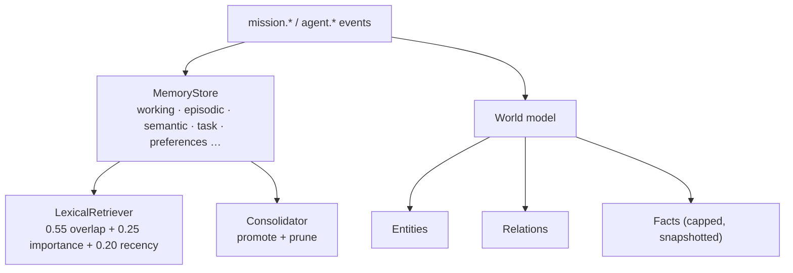

## Runtimes: tools, desktop, browser, voice, vision

One permission-gated tool runtime fronts every capability. Built-in, MCP, and
plugin tools share a single registry, and MCP servers are discovered and
hot-reloaded over a real stdio JSON-RPC client.

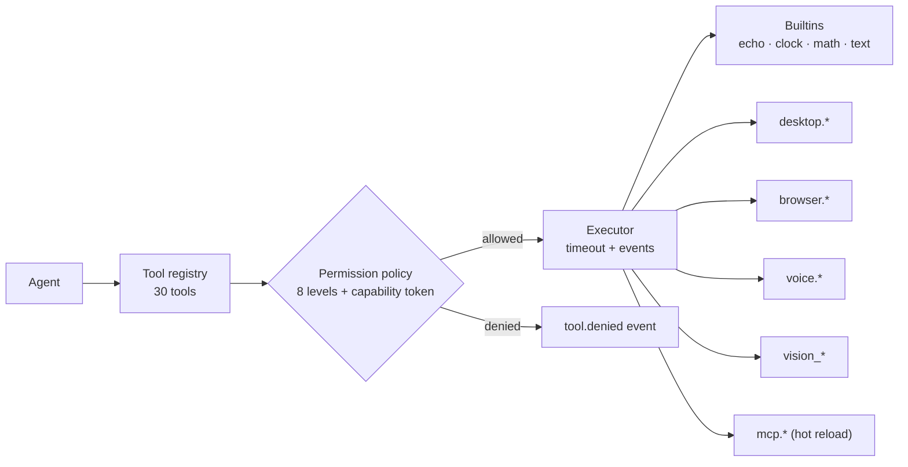

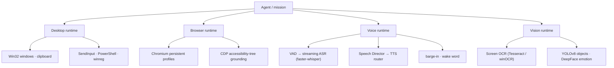

**Voice routing** picks a backend by language support, hardware, and
expressiveness, and keeps a backend pinned for a consistent turn:

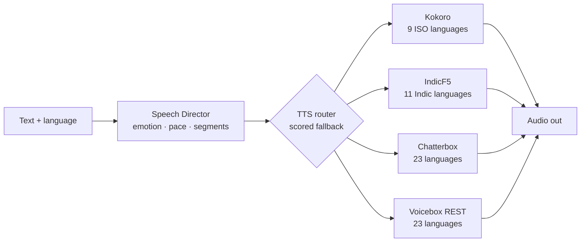

## Trust: security & observability

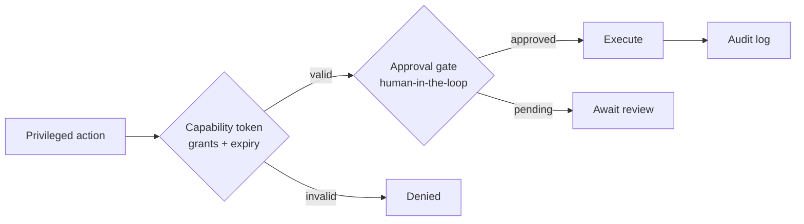

Every operation is appended to a **SHA-256 hash chain** seeded with `GENESIS`;
`verify_integrity()` re-walks the file and detects any tampering.

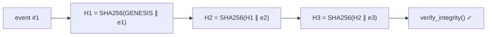

Observability is first-class: structured JSON logs, durable JSONL metrics and
spans, provider analytics, voice latency metrics, and an **execution replay**
engine that records per-step mission frames and can reload them exactly.

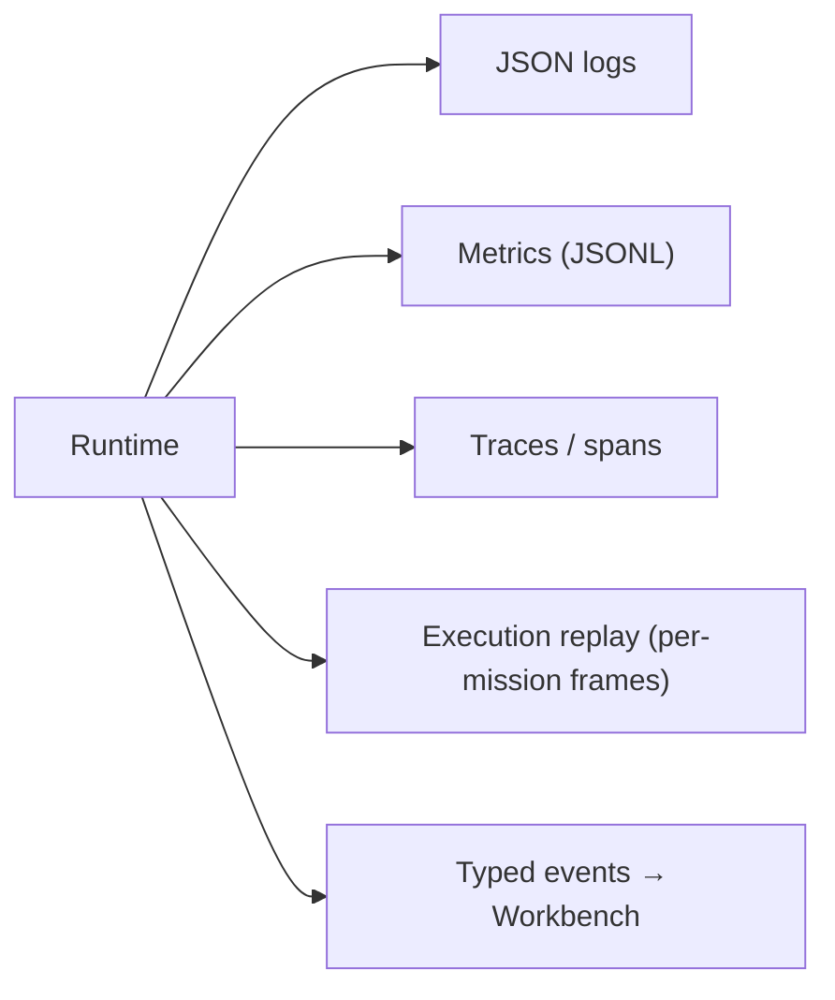

## The Workbench

A React + Vite control plane (`apps/emily-ui`) reads live state from the FastAPI
server: health, telemetry over WebSocket, missions, agents, chat, a non-custodial
wallet + x402 payment-requirement inspector, and an offline Web3 security
workbench. Values are reported by the backend and never estimated.

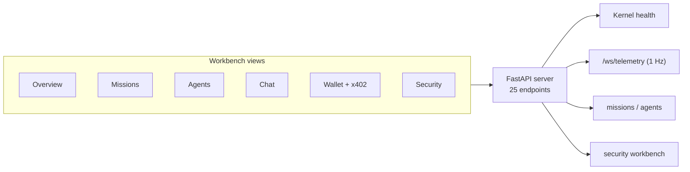

## Monorepo layout

19 workspace packages plus the CLI app and the UI.

| Package | Role |
|---|---|
| `emily-core` | Typed IDs, domain enums, error taxonomy, protocol ports |
| `emily-events` | Typed event envelopes + async bus |
| `emily-config` | Pydantic v2 settings |
| `emily-observability` | Logging, metrics, tracing, replay |
| `emily-kernel` | Executive kernel lifecycle + deep orchestration |
| `emily-providers` | LLM provider fabric (NVIDIA NIM, RoutesMe, router) |
| `emily-missions` | Mission runtime (LangGraph, checkpoints, control) |
| `emily-agents` | Agent runtime (spawn, supervise, verify) |
| `emily-memory` | Multi-kind memory + world model |
| `emily-tools` | Tool & MCP runtime (permissions, discovery, hot reload) |
| `emily-desktop` | Desktop runtime (Win32, clipboard, PowerShell, registry) |
| `emily-browser` | Browser runtime (Playwright, profiles, DOM grounding, CDP) |
| `emily-voice` | Local multilingual voice (ASR / TTS / VAD / Speech Director) |
| `emily-vision` | Screen capture, OCR, GUI grounding, object & emotion analysis |
| `emily-security` | Secrets vault, capability tokens, approval gates, audit chain |
| `emily-coding` | Repository AST indexing, static review, git |
| `emily-trading` | Paper-trading broker + risk enforcer |
| `emily-web3-security` | Offline, human-gated Solidity audit workbench |
| `emily-plugins` | Plugin discovery & lifecycle |
| `apps/emily-cli` | `emily` command-line interface |
| `apps/emily-ui` | React + Vite Workbench |

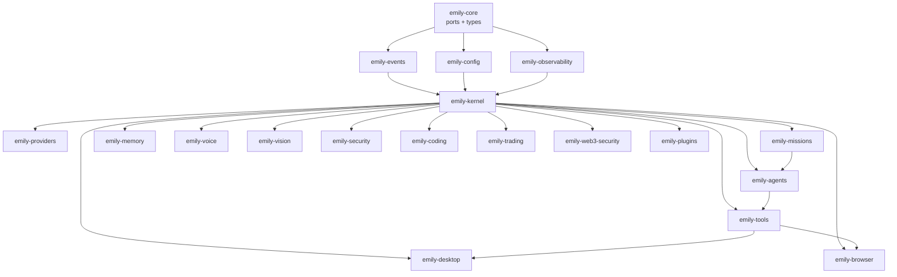

## Quick start

```powershell
git clone https://github.com/MrDecryptDecipher/EmilyOS.git
cd EmilyOS
python -m venv .venv
.\.venv\Scripts\Activate.ps1
python -m pip install -U pip
.\scripts\install-dev.ps1
copy .env.example .env      # then add your provider keys
emily version
emily health
emily providers
emily chat "hello"
```

### Optional voice stack

```powershell
pip install -e "packages/emily-voice[kokoro,asr,audio]"
# Optional expressive / Indic backends (large, opt-in):
# pip install chatterbox-tts
# pip install "git+https://github.com/ai4bharat/IndicF5.git"
python scripts/smoke_m8_voice.py
```

## CLI reference

72 commands across 11 groups plus the root app.

| Group | Commands |
|---|---|
| root | `version` · `health` · `config` · `boot` · `providers` · `chat` · `workbench`/`server`/`ui` · `orchestrate` · `benchmark` · `impress` |
| `mission` | `create` · `start` · `list` · `get` · `pause` · `resume` · `cancel` · `run` |
| `agent` | `roles` · `list` · `run` · `pipeline` · `stats` · `history` |
| `memory` | `kinds` · `put` · `get` · `search` · `stats` · `consolidate` |
| `world` | `show` · `observe` · `entities` |
| `tool` | `list` · `info` · `invoke` · `permissions` |
| `mcp` | `list` · `reload` · `show` |
| `desktop` | `status` · `windows` · `focus` · `clipboard` · `type` · `powershell` · `registry` |
| `browser` | `status` · `open` · `goto` · `snapshot` · `click` · `type` · `tabs` · `eval` · `close` |
| `voice` | `status` · `speak` · `listen` · `barge-in` · `models` · `converse` · `metrics` · `wake` · `serve` |
| `vision` | `screenshot` |
| `security` | `set-secret` · `get-secret` · `audit` |

## Configuration

Non-secret defaults live in [`configs/default.yaml`](configs/default.yaml);
everything else is `EMILY_`-prefixed environment variables documented in
[`.env.example`](.env.example). Secrets are never committed.

| Area | Keys (examples) |
|---|---|
| Providers | `EMILY_PRIMARY_PROVIDER`, `EMILY_NVIDIA_API_KEY`, `EMILY_ROUTESME_API_KEY` |
| Missions / agents | `EMILY_MISSION_LLM_PLANNER`, `EMILY_AGENT_MAX_CONCURRENT` |
| Voice | `EMILY_VOICE_ENABLED`, `EMILY_VOICE_WAKE_WORD`, `EMILY_TTS_DEFAULT` |
| Desktop / browser | `EMILY_DESKTOP_LIVE`, `EMILY_BROWSER_ENABLED` |
| Security | `EMILY_CONFIRM_DESTRUCTIVE_ACTIONS`, policy gates |

## Quality gates

```powershell
pytest                # test suite
ruff check packages apps tests
black --check packages apps tests
mypy                  # strict
```

344 test functions across 86 test files, branch-aware coverage with a 70%
floor, strict `mypy`, and Ruff/Black configured at line length 100.

## Roadmap

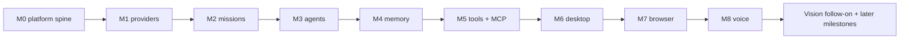

Milestones 0–8 are complete. See [`docs/architecture/`](docs/architecture) for
the full design notes and per-milestone test reports.

## License

Apache-2.0 — see [`LICENSE`](LICENSE).

---

<div align="center">

**Emily OS.** *Quietly capable. Always observable.*

</div>
