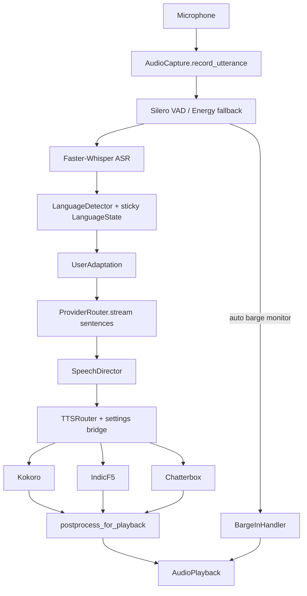

# Voice Architecture

Emily's local-first multilingual voice stack lives in `packages/emily-voice`.

## Pipeline

## Compliance (gaps closed)

| Area | Status |
|------|--------|
| Continuous VAD listen + true VAD latency | Done |
| Auto barge-in while speaking | Done |
| Settings bridge (enable flags, device, director flags) | Done |
| Pipelined LLM → sentence TTS | Done |
| Audio postprocess on TTS path | Done |
| Metrics RTF + memory + e2e | Done |
| Hardware MPS + `resolve_torch_device` | Done |
| ModelManager.verify + load/unload engines | Done |
| IndicF5.available tightened | Done |
| User adaptation profile | Done |
| LanguageState.sticky | Done |

Live TTS backends are optional extras (`emily-voice[kokoro|indicf5|chatterbox]`). Smoke and integration tests use real Kokoro when installed; otherwise they skip honestly (`scripts/smoke_m8_voice_live.py`, `scripts/smoke_m8_voice.py`).

## Modules

| Area | Role |
|------|------|
| `speech.SpeechDirector` | Language, style, pace, emotion, backend hint, sentence segments |
| `settings_bridge` | `tts_enable_*`, `tts_device`, voice feature flags |
| `tts.router` | Capability-aware routing + fallbacks + LOW-hardware bias |
| `session.VoiceConversationEngine` | VAD listen, streaming converse, barge monitor |
| `adaptation` | Per-user pacing / formality profile |
| `models_mgr.ModelManager` | Status / verify / explicit download only |
| `hardware.detect_hardware` | LOW/MEDIUM/HIGH + MPS/VRAM |
| `metrics.VoiceMetrics` | TTFA / ASR / TTS / RTF / memory (no raw mic logs) |

## Kernel

`VoiceSubsystem` (priority 31) gated by `EMILY_VOICE_ENABLED`. Sets `ctx.voice_runtime`.

## Fallbacks

- Chatterbox missing → IndicF5 / Kokoro
- IndicF5 missing → Kokoro (or Chatterbox if Hindi+expressive)
- GPU missing → CPU (`tts_device=auto`); MPS when available
- LOW profile → prefer Kokoro over IndicF5/Chatterbox
- Silero missing / `voice_prefer_energy_vad` → Energy VAD
- ASR / mic missing → honest `BackendUnavailableError`

## Vision

Screen/OCR/GUI grounding remains a follow-on (`emily-vision`); M8 voice compliance gaps above are closed.
