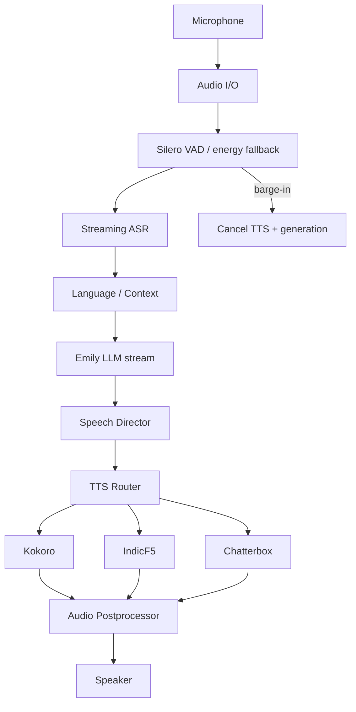

# Milestone 8 — Adaptive Multilingual Local Voice Engine

## Audit summary

```text
Current Emily Architecture
  packages/* + emily-cli kernel (M0–M7)
        ↓
Existing Voice Pipeline
  Config flags only (voice_enabled=false, wake_word)
  Empty legacy app/voice stubs — unused
  ProviderKind.STT/TTS + AgentKind.VOICE enums — no adapters/workers
        ↓
Reusable Components
  ExecutiveKernel / BaseSubsystem
  ProviderRouter.stream (LLM)
  MemoryRuntime / preferences
  Event bus, settings, CLI registration, smoke/pytest patterns
        ↓
Components That Need Replacement
  app/voice/* empty stubs (ignore)
        ↓
Components That Need Extension
  EmilySettings, DefaultKernelContext, EventTypes,
  ToolPermissionLevel, AgentRegistry/WorkerFactory
        ↓
New Voice Architecture
  packages/emily-voice — local-first ASR/TTS/VAD/Speech Director
```

## Scope

**In M8 (this doc):** conversational voice stack (Silero VAD, streaming ASR, Speech Director, TTS router: Kokoro / IndicF5 / Chatterbox, barge-in, metrics).

**Deferred:** full Vision/OCR/GUI grounding (roadmap still groups Vision under M8; implement as follow-on package `emily-vision`). UI voice controls defer to M12 Tauri UI — CLI + tools for M8.

## Design principles

1. Local-first, open-source TTS/ASR — no mandatory proprietary cloud voice.
2. Lazy model load — never load IndicF5/Chatterbox until routed.
3. No silent multi-GB downloads at startup — explicit `emily voice models …`.
4. No fabricated audio — unavailable backends raise / fall back honestly.
5. Natural conversation > theatrical fillers.
6. Code-switching preserved; language state is sticky.
7. Barge-in mandatory: speaking → user speech → cancel TTS/LLM.

## Package layout

`packages/emily-voice` → `emily.voice`

```text
voice/
  audio/ capture, playback, processing, interruption
  asr/ base, whisper (faster-whisper), language helpers
  tts/ base, kokoro, indicf5, chatterbox, router, registry
  speech/ director, prosody, styles, pauses, segmentation
  session/ state, turn_taking, barge_in, conversation
  models/ manager, hardware
  runtime, subsystem, tools, policy, metrics, personality
```

## Pipeline



## Acceptance (voice)

- Modular ASR/TTS interfaces + TTS router + Speech Director + model/hardware managers
- Kokoro default lightweight path; IndicF5/Chatterbox optional lazy
- Fallbacks when optional models missing
- Streaming sentence-level TTS where backends support chunks
- Continuous VAD listen + auto barge-in monitor + turn-taking states
- Language detection + sticky LanguageState + code-switching policy
- Settings bridge, user adaptation, audio postprocess, RTF/memory metrics
- Docs: VOICE_*.md + this milestone design + VOICE_NATURALNESS.md
- Tests + smoke without requiring all heavy models installed

## Status

**Complete (voice) — compliance gaps closed** — see [26-milestone-8-complete.md](26-milestone-8-complete.md). Live TTS remains optional extras. Vision/OCR deferred.
